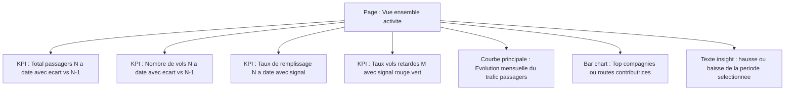
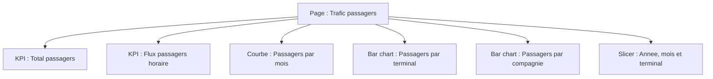
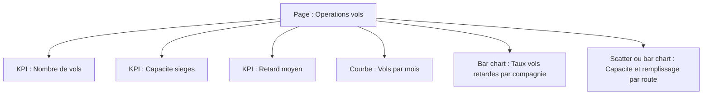
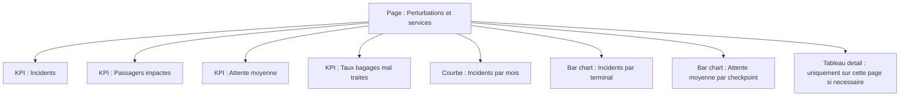

# Cadrage - Regeneration du rapport Airports

## 1. Perimetre du rapport

Objectif metier : reconstruire le rapport Airports comme une histoire analytique lisible sur l'activite aeroportuaire, en appliquant les nouvelles regles Power BI : granularite par page, tendances visibles sur les KPI, declinaisons temporelles des mesures et validation du cadrage avant modification PBIP.

Question principale : comment evoluent le trafic, la ponctualite, les perturbations et la qualite de service de l'aeroport, et quels segments expliquent les ecarts ?

Utilisateurs cibles : direction aeroportuaire, operations, experience passager et responsables de capacite.

## 2. Structure proposee du rapport

Le rapport conserve 4 pages, mais leur role est clarifie pour eviter les pages fourre-tout.

| Ordre | Page | Role narratif | Granularite dominante |
|---:|---|---|---|
| 1 | Vue d'ensemble de l'activite | Synthese executive : volume, capacite, ponctualite et signal de tendance | Synthese mensuelle / annuelle |
| 2 | Trafic passagers | Comprendre les volumes passagers et leur evolution | Passagers |
| 3 | Operations vols | Suivre l'activite vols, la capacite et les retards | Vols |
| 4 | Perturbations & services | Identifier les incidents, files d'attente et bagages mal traites | Qualite de service |

La premiere page ne doit contenir aucun tableau. Elle doit montrer les KPI essentiels, leurs tendances et un visuel principal lisible.

## 3. Schemas Mermaid par page

### Page 1 - Vue d'ensemble de l'activite



### Page 2 - Trafic passagers



### Page 3 - Operations vols



### Page 4 - Perturbations & services



## 4. Prerequis calendrier

Convention existante du modele : les relations utilisent `Dim_Date`, pas `DimDate`. Les mesures existantes de signal s'appuient deja sur `Dim_Date[Date]`.

Constat :

- `Dim_Date[Date]` existe en type dateTime et est reliee aux tables de faits.
- `Dim_Date[Year]`, `Dim_Date[MonthNo]` et `Dim_Date[MonthName]` existent.
- `Dim_Date[YearMonth]` n'existe pas encore.
- Un indicateur de mois courant n'existe pas encore.

Ajustements proposes avant les mesures temporelles :

| Table | Element | Formule / definition proposee | Raison |
|---|---|---|---|
| `Dim_Date` | `YearMonth` | `FORMAT('Dim_Date'[Date], "yyyy-MM")` | Axe stable pour les tendances mensuelles |
| `Dim_Date` | `IsCurrentMonth` | `YEAR('Dim_Date'[Date]) = YEAR(TODAY()) && MONTH('Dim_Date'[Date]) = MONTH(TODAY())` | Filtrer ou signaler le mois courant |

Relations a conserver :

- `Fact_Flights[FlightDate]` -> `Dim_Date[Date]`
- `Fact_PaxFlow_Hourly[Date]` -> `Dim_Date[Date]`
- `Fact_Incidents[Date]` -> `Dim_Date[Date]`
- `Fact_Baggage[Date]` -> `Dim_Date[Date]`
- `Fact_QueueEvents[Date]` -> `Dim_Date[Date]`

## 5. Mesures DAX a creer ou enrichir

Les mesures metier existantes ne doivent pas etre dupliquees. Les declinaisons temporelles seront ajoutees dans `Fact_Flights.tmdl`, qui heberge deja les mesures du rapport Airports.

### Mesures principales existantes a reutiliser

| Mesure | Formule actuelle | Role metier | Pages ciblees |
|---|---|---|---|
| `Total passagers` | `SUM(Fact_Flights[PassengerCount])` | Volume de trafic | Vue d'ensemble, Trafic passagers |
| `Nombre de vols` | `COUNTROWS(Fact_Flights)` | Activite operationnelle | Vue d'ensemble, Operations vols |
| `Capacite sieges` | `SUM(Fact_Flights[SeatCapacity])` | Offre capacitaire | Operations vols |
| `Taux de remplissage` | `DIVIDE([Total passagers], [Capacite sieges])` | Efficacite capacitaire | Vue d'ensemble, Operations vols |
| `Retard moyen (min)` | `AVERAGE(Fact_Flights[DelayMinutes])` | Ponctualite | Vue d'ensemble, Operations vols |
| `Vols retardes` | `CALCULATE([Nombre de vols], Fact_Flights[DelayMinutes] > 15)` | Volume de vols en retard | Operations vols |
| `Taux vols retardes` | `DIVIDE([Vols retardes], [Nombre de vols])` | Qualite operationnelle | Vue d'ensemble, Operations vols |
| `Flux passagers horaire` | `SUM(Fact_PaxFlow_Hourly[TotalPax])` | Charge horaire passagers | Trafic passagers |
| `Incidents` | `COUNTROWS(Fact_Incidents)` | Perturbations | Perturbations & services |
| `Passagers impactes` | `SUM(Fact_Incidents[PassengerImpacted])` | Impact passager | Perturbations & services |
| `Attente moyenne (min)` | `AVERAGE(Fact_QueueEvents[AvgWaitMin])` | Experience checkpoint | Perturbations & services |
| `Bagages charges` | `SUM(Fact_Baggage[LoadedBags])` | Volume bagages | Perturbations & services |
| `Bagages mal traites` | `SUM(Fact_Baggage[MishandledBags])` | Defauts bagages | Perturbations & services |
| `Taux bagages mal traites` | `DIVIDE([Bagages mal traites], [Bagages charges])` | Qualite bagages | Perturbations & services |

### Famille temporelle standard

Pour chaque mesure temporellement analysable retenue, creer les variantes suivantes si elles n'existent pas deja :

```DAX
<Mesure> N = CALCULATE([<Mesure>], YEAR('Dim_Date'[Date]) = YEAR(TODAY()))
<Mesure> N-1 = CALCULATE([<Mesure>], SAMEPERIODLASTYEAR('Dim_Date'[Date]))
<Mesure> N a date = CALCULATE([<Mesure>], DATESYTD('Dim_Date'[Date]))
<Mesure> N-1 a date = CALCULATE([<Mesure>], SAMEPERIODLASTYEAR(DATESYTD('Dim_Date'[Date])))
Ecart <Mesure> N vs N-1 = [<Mesure> N] - [<Mesure> N-1]
Ecart % <Mesure> N vs N-1 = DIVIDE([Ecart <Mesure> N vs N-1], [<Mesure> N-1])
Ecart <Mesure> N a date vs N-1 a date = [<Mesure> N a date] - [<Mesure> N-1 a date]
Ecart % <Mesure> N a date vs N-1 a date = DIVIDE([Ecart <Mesure> N a date vs N-1 a date], [<Mesure> N-1 a date])
<Mesure> M = CALCULATE([<Mesure>], YEAR('Dim_Date'[Date]) = YEAR(TODAY()), MONTH('Dim_Date'[Date]) = MONTH(TODAY()))
<Mesure> M-1 = CALCULATE([<Mesure>], PREVIOUSMONTH('Dim_Date'[Date]))
Ecart <Mesure> M vs M-1 = [<Mesure> M] - [<Mesure> M-1]
Ecart % <Mesure> M vs M-1 = DIVIDE([Ecart <Mesure> M vs M-1], [<Mesure> M-1])
```

### Mesures a decliner en priorite

| Mesure source | Niveau temporel | Declinaisons proposees | Justification |
|---|---|---|---|
| `Total passagers` | Jour, mois, annee | N, N-1, N a date, N-1 a date, M, M-1, ecarts valeur et % | Indicateur principal de trafic |
| `Nombre de vols` | Jour, mois, annee | N, N-1, N a date, N-1 a date, M, M-1, ecarts valeur et % | Indicateur principal d'activite |
| `Capacite sieges` | Jour, mois, annee | N, N-1, N a date, N-1 a date, M, M-1, ecarts valeur et % | Mesure l'offre disponible |
| `Taux de remplissage` | Mois, annee | N, N-1, N a date, N-1 a date, M, M-1, ecarts points et % | Suit l'efficacite capacitaire |
| `Retard moyen (min)` | Mois, annee | N, N-1, N a date, N-1 a date, M, M-1, ecarts valeur et % | Baisse = amelioration metier |
| `Vols retardes` | Jour, mois, annee | N, N-1, N a date, N-1 a date, M, M-1, ecarts valeur et % | Quantifie la degradation operationnelle |
| `Taux vols retardes` | Mois, annee | N, N-1, N a date, N-1 a date, M, M-1, ecarts points et % | KPI de ponctualite |
| `Flux passagers horaire` | Heure, jour, mois | M, M-1, ecarts valeur et % | Charge operationnelle fine, moins adaptee aux KPI annuels |
| `Incidents` | Jour, mois, annee | N, N-1, N a date, N-1 a date, M, M-1, ecarts valeur et % | Suit les perturbations |
| `Passagers impactes` | Jour, mois, annee | N, N-1, N a date, N-1 a date, M, M-1, ecarts valeur et % | Mesure l'impact client |
| `Attente moyenne (min)` | Mois, annee | N, N-1, N a date, N-1 a date, M, M-1, ecarts valeur et % | Baisse = amelioration metier |
| `Taux bagages mal traites` | Mois, annee | N, N-1, N a date, N-1 a date, M, M-1, ecarts points et % | Baisse = amelioration metier |

Les ecarts en pourcentage devront avoir un format Power BI en pourcentage. Pour les taux, il faudra distinguer l'ecart en points de pourcentage de l'ecart relatif.

## 6. Graphiques a creer ou reconstruire

| Page | Graphique | Type | Mesures | Axes / segmentation | Pertinence |
|---|---|---|---|---|---|
| Vue d'ensemble | Evolution du trafic passagers | Line chart | `Total passagers`, signal de tendance | `Dim_Date[YearMonth]` | Montre immediatement si l'activite progresse |
| Vue d'ensemble | Top contributeurs au trafic | Bar chart | `Total passagers` | compagnie ou route | Explique les moteurs de volume |
| Trafic passagers | Trafic par mois | Line chart | `Total passagers`, ecart % M vs M-1 | `Dim_Date[YearMonth]` | Analyse temporelle du trafic |
| Trafic passagers | Trafic par terminal | Bar chart | `Total passagers` | terminal | Identifie les zones de charge |
| Trafic passagers | Flux horaire | Heatmap ou bar chart | `Flux passagers horaire` | heure, terminal | Detecte les pics d'affluence |
| Operations vols | Vols par mois | Line chart | `Nombre de vols` | `Dim_Date[YearMonth]` | Suit l'activite operationnelle |
| Operations vols | Retards par compagnie | Bar chart | `Taux vols retardes`, `Retard moyen (min)` | compagnie | Priorise les analyses operations |
| Operations vols | Capacite et remplissage par route | Combo ou scatter | `Capacite sieges`, `Taux de remplissage` | route | Met en regard offre et demande |
| Perturbations & services | Incidents par mois | Line chart | `Incidents` | `Dim_Date[YearMonth]` | Suit la degradation dans le temps |
| Perturbations & services | Incidents par terminal | Bar chart | `Incidents`, `Passagers impactes` | terminal | Localise les zones problematiques |
| Perturbations & services | Attente checkpoint | Bar chart | `Attente moyenne (min)` | checkpoint | Identifie les files les plus critiques |
| Perturbations & services | Qualite bagages | Bar chart | `Taux bagages mal traites` | terminal ou periode | Suit la qualite de service |

## 7. Relations ou ajustements du modele

Aucune nouvelle relation n'est proposee a ce stade. Les relations existantes vers `Dim_Date` couvrent les faits necessaires aux declinaisons temporelles.

Risque a traiter : le modele contient aussi une table `DimDate` non conventionnelle avec `Date` en int64. Pour la regeneration, la convention doit rester `Dim_Date`, car c'est elle qui porte les relations actives du rapport existant.

## 8. Coherence de granularite

- Page 1 : synthese executive uniquement, avec KPI et tendances.
- Page 2 : trafic passagers, sans melanger les incidents ni les bagages.
- Page 3 : operations vols, capacite et ponctualite.
- Page 4 : perturbations et qualite de service, avec tableaux seulement si un detail operationnel est utile.

Chaque KPI devra afficher une tendance rouge ou verte selon le sens metier :

- hausse du trafic, des vols, du remplissage : vert par defaut ;
- hausse du retard, des vols retardes, des incidents, de l'attente et des bagages mal traites : rouge ;
- baisse de ces indicateurs de degradation : vert.

## 9. Narration du rapport

Le rapport doit se lire comme une progression :

1. Comprendre la situation globale et la tendance.
2. Expliquer le trafic passagers.
3. Diagnostiquer les operations vols.
4. Identifier les perturbations et les leviers de service.

Cette structure privilegie la decision utilisateur plutot que l'affichage exhaustif de toutes les colonnes disponibles.

## 10. Design Sodiparc

La regeneration applique le theme `Template_Sodiparc_JSON` comme source de verite visuelle du rapport Airports.

- Palette principale : bleu `#006DAA`, cyan `#00A2D5`, gris `#4C4C4C`, violet `#8C0B9D`, vert `#57B35C`, orange `#F58B18`, rouge `#DC3E3E`.
- Typographie : `Segoe UI` pour les libelles, `Segoe UI Semibold` pour les titres et en-tetes.
- Pages : format widescreen, fond `#F5F5F5`, visuels en cartes blanches.
- Visuels : bordures `#cbd5e1`, radius 6, padding 16, titres centres pour les graphiques, legendes en haut.
- KPI : valeur sombre `#0f172a`, libelle gris `#64748b`, signal rouge/vert selon le sens metier.
- Tableaux : en-tetes centres, contraste fort, totaux visibles, utilisation reservee aux pages d'exploration.

Le theme est declare dans `definition/report.json` et stocke dans `StaticResources/SharedResources/BaseThemes/Template_Sodiparc_JSON.json`.

## 11. Validation obligatoire avant construction

Conformement aux nouvelles regles, aucune mesure, page, relation ou visual PBIP ne doit etre modifie avant validation explicite de ce cadrage.

Validation attendue : `Je valide`, `OK tu peux construire`, `Tu peux commencer`, `Lance la creation` ou `Le plan est bon`.

Apres validation, la regeneration se fera dans cet ordre :

1. Enrichir `Dim_Date` avec les attributs calendrier manquants si necessaire.
2. Ajouter les declinaisons temporelles sans dupliquer les mesures existantes.
3. Reconstruire les visuels PBIP page par page.
4. Verifier que chaque mesure referencee par les visuels existe exactement une fois.
5. Controler la coherence JSON/TMDL et l'absence de regression de structure PBIP.
