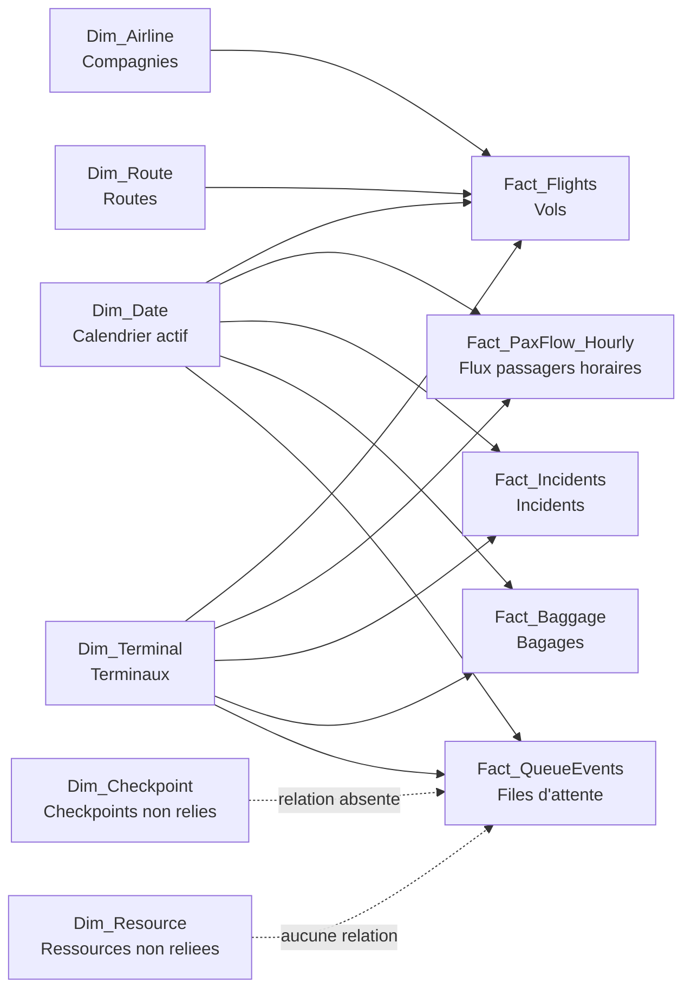
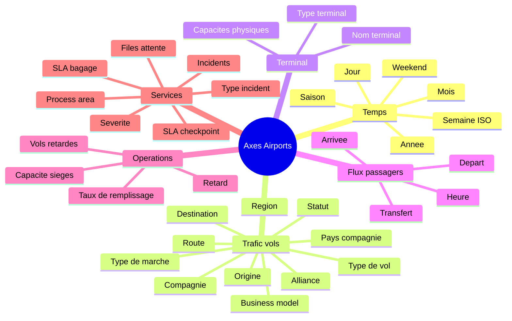

# Cartographie analytique du modele Power BI - Airports

## 1. Vue d'ensemble du modele

Le modele Airports contient un schema aeroportuaire centre sur cinq domaines d'analyse :

- trafic vols et passagers ;
- flux passagers horaires ;
- incidents operationnels ;
- files d'attente et checkpoints ;
- bagages et qualite de service.

Point important : le modele contient deux familles de tables.

| Famille | Exemple | Statut analytique |
|---|---|---|
| Tables sans underscore | `DimAirline`, `FactBaggage`, `DimDate` | Anciennes tables ou tables importees non reliees au schema actif. A ne pas privilegier pour la regeneration. |
| Tables avec underscore | `Dim_Airline`, `Fact_Flights`, `Dim_Date` | Schema actif du rapport. Les relations declarees pointent vers ces tables. |

Pour ameliorer le rapport, la convention a conserver est donc : utiliser les tables avec underscore, notamment `Dim_Date`, `Dim_Airline`, `Dim_Route`, `Dim_Terminal`, `Fact_Flights`, `Fact_PaxFlow_Hourly`, `Fact_Incidents`, `Fact_Baggage` et `Fact_QueueEvents`.

## 2. Tables de faits identifiees

| Table | Grain probable | Mesures principales | Dimensions reliees |
|---|---|---|---|
| `Fact_Flights` | Une ligne par vol | `Nombre de vols`, `Total passagers`, `Capacite sieges`, `Retard moyen (min)`, `Taux vols retardes` | Date, compagnie, route, terminal |
| `Fact_PaxFlow_Hourly` | Une ligne par date, heure et terminal | `Flux passagers horaire`, passagers depart, arrivee, transfert | Date, terminal |
| `Fact_Incidents` | Une ligne par incident | `Incidents`, `Passagers impactes`, duree d'incident | Date, terminal |
| `Fact_Baggage` | Une ligne par vol ou operation bagage | `Bagages charges`, `Bagages mal traites`, `Taux bagages mal traites`, temps premier/dernier bagage | Date, terminal |
| `Fact_QueueEvents` | Une ligne par evenement de file d'attente | `Attente moyenne (min)`, longueur de file, taux d'arrivee, taux de service, voies ouvertes | Date, terminal |

### Table de faits : `Fact_Flights`

Une ligne semble representer un vol. C'est la table centrale pour raconter l'activite aerienne.

Mesures exploitables :

- nombre de vols ;
- total passagers ;
- capacite sieges ;
- taux de remplissage ;
- retard moyen ;
- taux de vols retardes.

Axes possibles :

- temps via `Dim_Date` ;
- compagnie via `Dim_Airline` ;
- route via `Dim_Route` ;
- terminal via `Dim_Terminal` ;
- type de mouvement via `Fact_Flights[MovementType]` ;
- statut de vol via `Fact_Flights[FlightStatus]`.

Risque de granularite : ne pas additionner directement `Fact_Flights[PassengerCount]` avec `Fact_PaxFlow_Hourly[TotalPax]` dans le meme KPI sans expliquer la difference de grain. Le premier est rattache au vol, le second au flux horaire terminal.

### Table de faits : `Fact_PaxFlow_Hourly`

Une ligne semble representer un flux passagers a une heure donnee pour un terminal.

Mesures exploitables :

- flux passagers total ;
- passagers au depart ;
- passagers a l'arrivee ;
- passagers en correspondance.

Axes possibles :

- date, mois, annee ;
- heure ;
- terminal.

Risque de granularite : cette table est ideale pour les pics horaires, pas pour remplacer le volume passagers officiel par vol.

### Table de faits : `Fact_Incidents`

Une ligne semble representer un incident operationnel.

Mesures exploitables :

- nombre d'incidents ;
- passagers impactes ;
- duree d'incident ;
- repartition par type, severite et statut.

Axes possibles :

- date ;
- heure ;
- terminal ;
- zone de processus ;
- type d'incident ;
- severite ;
- statut.

Risque de granularite : les incidents peuvent etre compares au trafic global par periode ou terminal, mais pas attribues a une compagnie ou une route sans relation explicite.

### Table de faits : `Fact_Baggage`

Une ligne semble representer une operation bagage associee a un vol ou un terminal.

Mesures exploitables :

- bagages charges ;
- bagages mal traites ;
- taux de bagages mal traites ;
- temps premier bagage ;
- temps dernier bagage ;
- conformite SLA bagages.

Axes possibles :

- date ;
- terminal ;
- tapis bagage ;
- conformite SLA.

Risque de granularite : `FlightID` existe dans `Fact_Baggage`, mais aucune relation vers `Fact_Flights[FlightID]` n'est declaree dans `relationships.tmdl`. Les analyses bagage par compagnie ou route ne sont donc pas fiables tant qu'une relation ou un modele de pont n'est pas ajoute.

### Table de faits : `Fact_QueueEvents`

Une ligne semble representer un evenement de file d'attente a un checkpoint et une heure.

Mesures exploitables :

- attente moyenne ;
- longueur de file ;
- taux d'arrivee passagers ;
- taux de service ;
- voies ouvertes ;
- conformite SLA.

Axes possibles :

- date ;
- heure ;
- terminal ;
- checkpoint ;
- zone de processus ;
- conformite SLA.

Risque de granularite : `CheckpointID` existe mais la relation vers `Dim_Checkpoint` n'est pas declaree. Les analyses par checkpoint doivent donc utiliser la colonne de fait ou attendre une relation dediee.

## 3. Tables de dimensions identifiees

| Table | Role | Colonnes utiles | Faits relies |
|---|---|---|---|
| `Dim_Airline` | Compagnie aerienne | `AirlineName`, `BusinessModel`, `Alliance`, `Country` | `Fact_Flights` |
| `Dim_Route` | Route aerienne | `Origin`, `Destination`, `HaulType`, `Market`, `Region`, `DistanceKm` | `Fact_Flights` |
| `Dim_Terminal` | Terminal aeroportuaire | `TerminalName`, `TerminalType`, capacites physiques | `Fact_Flights`, `Fact_PaxFlow_Hourly`, `Fact_Incidents`, `Fact_Baggage`, `Fact_QueueEvents` |
| `Dim_Checkpoint` | Checkpoint operationnel | `ProcessArea`, capacite nominale, criticite | Non relie actuellement |
| `Dim_Resource` | Ressources humaines / pools | `Role`, `Shift`, `Department`, `PlannedHeadcount` | Non relie actuellement |

## 4. Tables calendaires identifiees

| Table | Statut | Commentaire |
|---|---|---|
| `Dim_Date` | Calendrier actif | Relie aux tables de faits avec underscore. A utiliser pour les mesures temporelles. |
| `DimDate` | Calendrier historique ou duplique | Non relie au schema actif du rapport. A eviter pour la regeneration. |
| `LocalDateTable_*` | Table automatique Power BI | Table technique generee par Power BI. Ne pas l'utiliser comme axe metier principal. |
| `DateTableTemplate_*` | Table technique | Modele interne Power BI. |

`Dim_Date` contient deja `Date`, `Year`, `MonthNo`, `MonthName`, `ISOWeek`, `Day`, `DayName`, `IsWeekend` et `Seasonality`.

Ameliorations proposees avant les visuels temporels :

- ajouter `YearMonth` pour stabiliser les axes mensuels ;
- ajouter `IsCurrentMonth` si on veut filtrer ou annoter le mois courant ;
- verifier le typage reel de `Dim_Date[Date]`, car la source M transforme encore `Date` en `Int64.Type` alors que le TMDL expose la colonne en `dateTime`.

## 5. Tables de pont ou mapping identifiees

Aucune table de pont explicite n'est declaree.

Ponts potentiellement utiles plus tard :

- `Fact_Baggage[FlightID]` vers `Fact_Flights[FlightID]` si l'analyse bagage doit etre reliee a la compagnie, route ou statut du vol ;
- `Fact_QueueEvents[CheckpointID]` vers `Dim_Checkpoint[CheckpointID]` pour analyser les files par checkpoint et criticite ;
- `Dim_Checkpoint[TerminalID]` vers `Dim_Terminal[TerminalID]` si l'on veut une hierarchie terminal > checkpoint.

## 6. Schema Mermaid global du modele

## 7. Axes d'analyse disponibles

## 8. Hierarchies analytiques

Hierarchies fiables :

- Temps : annee > mois > semaine ISO > jour.
- Route : region > marche > type de courrier > origine/destination > route.
- Compagnie : pays > alliance > business model > compagnie.
- Terminal : type de terminal > terminal.
- Service : terminal > process area > type d'incident ou SLA.

Hierarchies a fiabiliser :

- Terminal > checkpoint, car `Dim_Checkpoint` n'est pas reliee dans `relationships.tmdl`.
- Vol > bagage, car `Fact_Baggage[FlightID]` n'a pas de relation declaree avec `Fact_Flights[FlightID]`.
- Ressource > checkpoint ou process area, car `Dim_Resource` n'est pas reliee.

## 9. Croisements analytiques possibles

| Mesure | Axe de decoupage | Exemple d'analyse | Pertinence |
|---|---|---|---|
| `Total passagers` | Mois / annee | Evolution du trafic | Analyse executive du volume |
| `Total passagers` | Compagnie | Top compagnies contributrices | Identifier les moteurs de trafic |
| `Total passagers` | Route / region | Routes et marches dominants | Comprendre la structure reseau |
| `Nombre de vols` | Mois / annee | Evolution de l'activite | Suivre la saisonnalite operationnelle |
| `Taux de remplissage` | Route | Adequation capacite / demande | Reperer les routes sous ou sur remplies |
| `Retard moyen (min)` | Compagnie | Ponctualite par compagnie | Prioriser les plans operations |
| `Taux vols retardes` | Terminal | Performance operationnelle par terminal | Localiser les zones de retard |
| `Flux passagers horaire` | Heure et terminal | Pics d'affluence | Dimensionner les ressources |
| `Incidents` | Mois / terminal | Evolution des perturbations | Suivre la degradation service |
| `Incidents` | Severite / type | Nature des perturbations | Prioriser les causes majeures |
| `Passagers impactes` | Terminal | Impact client par zone | Prioriser les zones critiques |
| `Attente moyenne (min)` | Heure / terminal | Pics d'attente | Optimiser les files et voies ouvertes |
| `Taux bagages mal traites` | Terminal / periode | Qualite bagage | Suivre la qualite de service |

Croisements a eviter sans modification du modele :

- bagages par compagnie ou route ;
- attentes par criticite checkpoint depuis `Dim_Checkpoint` ;
- incidents par compagnie ;
- ressources planifiees vs files d'attente.

## 10. Risques de granularite

- `Fact_Flights` et `Fact_PaxFlow_Hourly` mesurent toutes deux des passagers, mais a des grains differents : vol vs heure-terminal.
- `Fact_Incidents` n'est reliee ni aux vols, ni aux compagnies, ni aux routes ; elle doit rester analysee par temps, terminal, type, severite et process area.
- `Fact_Baggage` contient `FlightID`, mais la relation vers les vols n'est pas declaree.
- `Fact_QueueEvents` contient `CheckpointID`, mais la relation vers `Dim_Checkpoint` n'est pas declaree.
- Les tables sans underscore peuvent creer de la confusion car elles doublonnent les tables actives.
- Les mesures sont principalement hebergees dans `Fact_Flights.tmdl`, meme lorsqu'elles lisent d'autres faits. Ce n'est pas bloquant, mais il faut eviter de creer des doublons dans d'autres tables.

## 11. Dimensions manquantes ou ameliorations possibles

Priorite haute :

- clarifier ou masquer les tables sans underscore dans le modele si elles ne servent plus ;
- ajouter `Dim_Date[YearMonth]` pour les axes mensuels ;
- ajouter les declinaisons temporelles standards des mesures principales apres validation ;
- documenter les mesures avec leur sens metier, surtout quand une hausse est negative.

Priorite moyenne :

- declarer une relation `Fact_QueueEvents[CheckpointID]` -> `Dim_Checkpoint[CheckpointID]` si les checkpoints sont uniques ;
- declarer une relation entre `Fact_Baggage[FlightID]` et `Fact_Flights[FlightID]` seulement si le grain et l'unicite de `FlightID` sont controles ;
- creer des mesures SLA : taux de conformite bagage, taux de conformite files, ecart attente vs SLA.

Priorite basse :

- relier `Dim_Resource` uniquement si une cle metier fiable existe vers les evenements, checkpoints ou terminaux ;
- creer une dimension heure si les analyses horaires deviennent centrales dans plusieurs pages.

## 12. Opportunites de pages de rapport

| Page | Objectif metier | Fait principal | Mesures | Axes | Limites |
|---|---|---|---|---|---|
| Vue d'ensemble de l'activite | Voir rapidement si l'aeroport progresse ou se degrade | `Fact_Flights` | Passagers, vols, remplissage, retards | Temps, terminal, compagnie | Pas de tableau sur la premiere page |
| Trafic passagers | Comprendre les volumes et pics de charge | `Fact_Flights`, `Fact_PaxFlow_Hourly` | Total passagers, flux horaire | Temps, terminal, heure, compagnie | Ne pas confondre passagers par vol et flux horaire |
| Operations vols | Diagnostiquer capacite et ponctualite | `Fact_Flights` | Vols, capacite, retard, taux vols retardes | Temps, compagnie, route, terminal | Rester centre sur le vol |
| Perturbations & services | Identifier les irritants service | `Fact_Incidents`, `Fact_QueueEvents`, `Fact_Baggage` | Incidents, attente, bagages mal traites, SLA | Temps, terminal, process area, type incident | Ne pas attribuer aux compagnies sans relation |
| Capacite & ressources | Explorer l'adequation ressources / demande | A definir | Ressources, lanes, service rate, attente | Terminal, checkpoint, shift | Necessite de fiabiliser `Dim_Resource` et `Dim_Checkpoint` |

## Synthese pour comprendre le modele

Le coeur fiable du modele est une etoile partielle : `Dim_Date` et `Dim_Terminal` filtrent presque tous les faits, tandis que `Dim_Airline` et `Dim_Route` filtrent uniquement les vols. Cela signifie que le rapport doit raconter :

1. le volume et la tendance globale avec `Fact_Flights` ;
2. les pics passagers avec `Fact_PaxFlow_Hourly` ;
3. la ponctualite avec `Fact_Flights` ;
4. les perturbations avec `Fact_Incidents`, `Fact_QueueEvents` et `Fact_Baggage`.

La regeneration du rapport doit donc eviter une page fourre-tout. Chaque page doit rester attachee a un grain principal, avec des KPI qui affichent une tendance et des graphiques qui expliquent un seul morceau de l'histoire.

## Validation avant construction

Ce fichier est une cartographie de cadrage. Aucune mesure, relation, page ou visual PBIP ne doit etre modifie avant validation explicite.

Validation attendue : `Je valide`, `OK tu peux construire`, `Tu peux commencer`, `Lance la creation` ou `Le plan est bon`.
